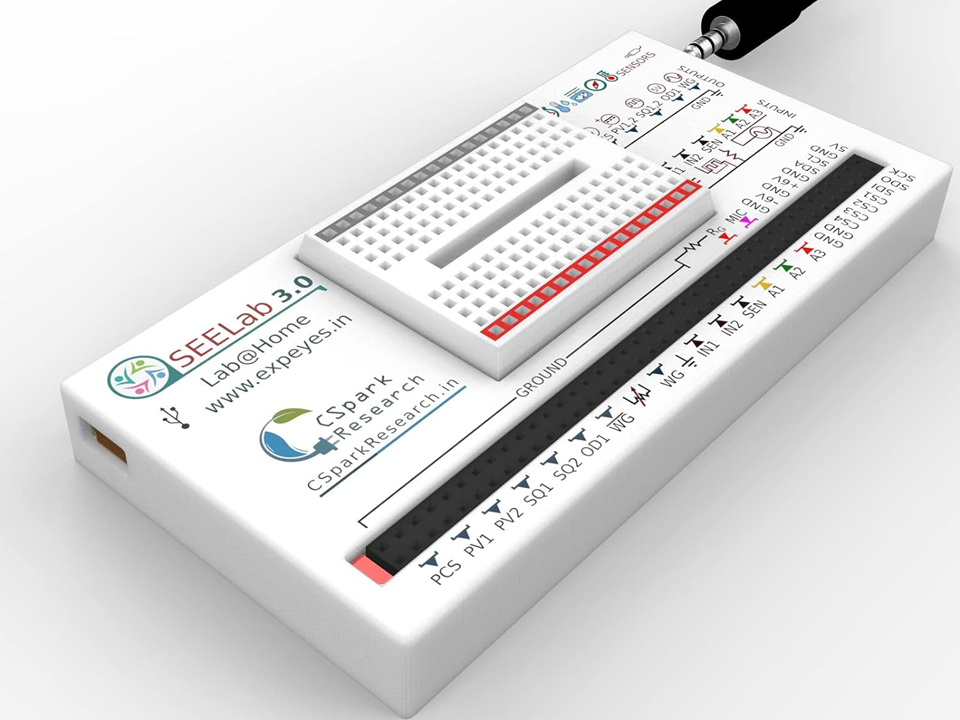
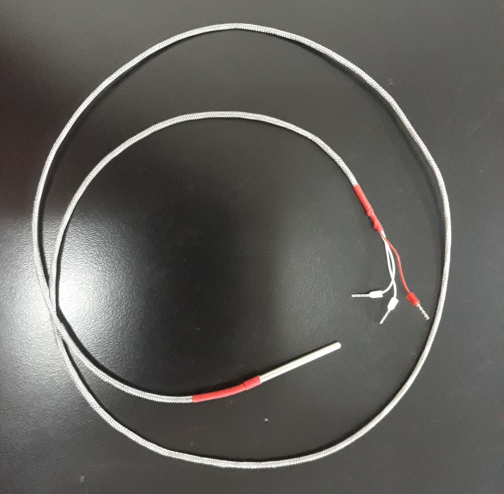
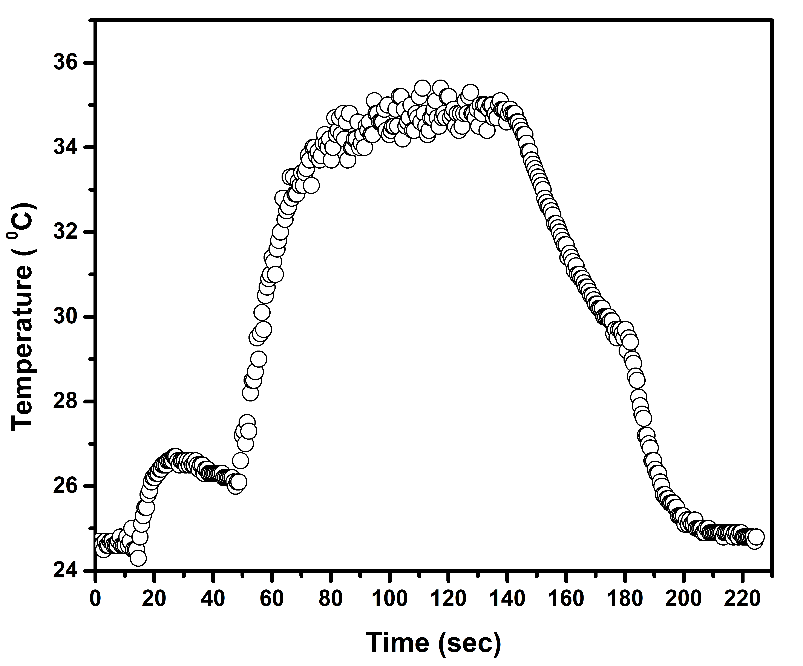

# Temperature-Data-Logger With PT1000 and ExpEYES
## Overview
This project aims to measure the temperature over time and record the data using PT1000 and ExpEYES. 

## Required Apparatus :
1. ExpEYES Module
2. Temperature Sensor (PT1000)
3. Connecting wires (with alligator clips, optional)



## Procedure:
**Connections**:
- Connect PT1000 between SEN and Ground of the ExpEYES Module.
  
**Data Acquisition**:
- Connect ExpEYES to PC via USB.
- Run the provided Temperature.py file.
- The current temperature will be displayed on the screen at 1 sec intervals.
- Logged temperature data (time, temperature) will be saved to "Temperature.dat".
- To modify the time interval (in seconds), update the value in Temperature.py at line 30.
  ``` python code
  time.sleep(1)
  ```
- Close the Python Shell to stop data logging.
  
> ### NOTES :
> - Make sure to delete the existing "Temperature.dat" file before running the Temperature.py file multiple times.

## Obtained Temperature :
Please make sure to securely grip the PT1000 probe and take the temperature for a few seconds.



## Special thanks to:

- Heartfelt thanks to Dr. Jithin B.P. from CSpark Research for his invaluable assistance and support. His expertise and guidance were instrumental in the successful completion of this project. Dr. Jithin, your unwavering help and dedication are deeply appreciated.

- Wholehearted thanks to the entire Inter-University Accelerator Centre (IUAC), New Delhi, India team especially Er. V.V.V. Satyanarayana, Mr. Abhijit Sarkar, and Dr. Ajith Kumar B. P. for developing the device and conducting the training program.

## License
This work is licensed under a [Creative Commons Attribution 4.0 International License](https://creativecommons.org/licenses/by/4.0/).


## Author
  - Dr. Ujjwal Ghanta


